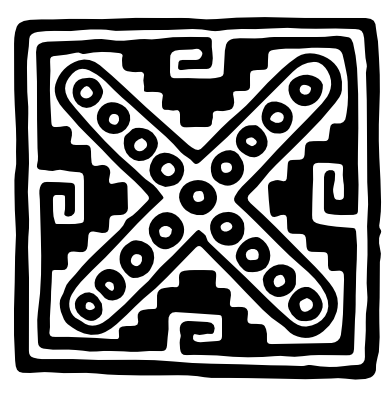

# Welcome to Molino
Molino is an online repository for open-access civic research and science-education projects. They are made by Kristopher José Aguayo-Barragán, a scientist and educator focused on integrating disparate knowledge systems and histories.

Molino means "mill" in Spanish. The name is inspired by ancient technologies independently developed by cultures all around the world. Mills transform raw materials into something usable. They can serve communities or concentrate power, depending on who owns them and why.

This mill aims to disperse power—making previously inaccessible and historically suppressed knowledge accessible.

*Last updated: September 18, 2026*

